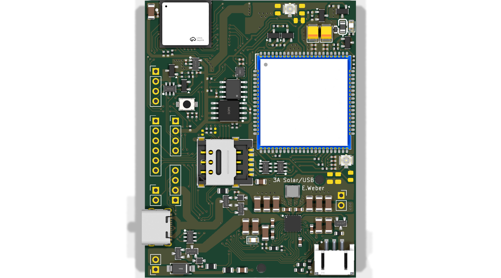

# Pinout - ecoTrace Communication Module (ESP32-C6-MINI-1)

Verified against schematic 2026-05-05. The authoritative machine-readable copy is
[`lib/EcoTrace/ecotrace_pins.h`](../lib/EcoTrace/ecotrace_pins.h) - this page is the
human-friendly version.

Exposed GPIOs on the MINI-1 module: `0,1,2,3,4,5,6,7,8,9,12,13,14,15,18,19,20,21,22,23`
(GPIO10,11,16,17 are not bonded on the MINI-1; GPIO24-30 are internal flash).

## By function

| GPIO | Net | Notes |
|-----:|-----|-------|
| 0 | MODEM_STATUS | A7672 STATUS out, but **only valid while the modem rail is on**: the translator (Q408) is gated by the modem's own 1V8, so with the rail off the line floats HIGH via R423 - indistinguishable from "modem running". Detect boot as the LOW→HIGH edge (or an AT response), never as a HIGH level. **Also a boot strap** - read briefly only |
| 1 | LED | status LED, active HIGH |
| 2 | QON | BQ25792 QON - pull LOW to wake. **Do not hold LOW > 2 s** (ship-mode risk). Pad TP404 |
| 3 | INT_shared | shared interrupt: SC7A20 accel + LTR-303 light |
| 4 | SPI_MOSI (SI) | to GD25Q128 flash |
| 5 | SPI_MISO (SO) | from GD25Q128 flash |
| 6 | I2C_SDA | LP_I2C, external 4k7 pull-up to 3V3 |
| 7 | I2C_SCL | LP_I2C, external 4k7 pull-up to 3V3 |
| 8 | SPI_CS_FLASH | GD25Q128 CS. Strapping pin, idles HIGH via 10k |
| 9 | SPI_CS_PERIPH | spare CS, **not populated**. Strapping + **BOOT pad** (TP403) |
| 12 | USB D− | native USB Serial/JTAG |
| 13 | USB D+ | native USB Serial/JTAG |
| 14 | SENSOR_PWR | populated high-side switch (active HIGH) for EXTERNAL sensor power on the SENSOR header. On-board sensors run on the always-on 3V3 (RT9080 LDO), not this switch |
| 15 | (tied to GND) | strapping pin |
| 18 | SPI_CLK | to GD25Q128 flash |
| 19 | INT_bq | BQ25792 fault / charge interrupt |
| 20 | MODEM_TX | ESP TX → modem RX |
| 21 | MODEM_RX | ESP RX ← modem TX |
| 22 | MODEM_PWRKEY | drives a **low-side inverter** (Q409): GPIO HIGH = PWRKEY asserted (pulled LOW at the modem), GPIO LOW = released. The firmware's idle-HIGH convention holds PWRKEY asserted, so the modem auto-boots as the rail rises - field-proven, but be aware of the inversion when porting |
| 23 | MODEM_PWR_EN | modem rail MOSFET; HIGH = modem powered |

## I2C device addresses (7-bit)

| Addr | Device |
|------|--------|
| 0x18 / 0x19 | SC7A20 accelerometer |
| 0x29 | LTR-303ALS ambient light |
| 0x35 / 0x60 | ATECC608B secure element (needs a wake pulse to answer) |
| 0x6B | BQ25792 charger / PMIC |

## Header labels (silkscreen)

Top-edge and side headers, per the board silkscreen:

- **SENSOR / I2C**: `GND · VSYS · SCL · SDA · 3V3`
- **SPI**: `GND · 3V3 · SCLK · SI · SO · CS`
- **BTN**: `GND · QON`
- **USB**: `GND · VUSB · DN · DP`
- **Programming pads** (back): `GND · 3V3 · RESET · BOOT · RX · TX`
- **Power**: `VIN (+/−, SWAPPED - see errata)`, `VBAT · TS · GND`, `VSYS`

## Debug / fixture pads (back side)

| Pad | Signal |
|-----|--------|
| TP401 | TXD0 - UART0 flash TX |
| TP402 | RXD0 - UART0 flash RX |
| TP403 | GPIO9 - CS_periph / **BOOT** fallback |
| TP404 | GPIO2 - QON / wake |
| EN | reset (10k to 3V3, 1µF to GND, button to GND) |

## Board landmarks

Renders: [`images/board_top.png`](images/board_top.png),
[`images/board_bottom.png`](images/board_bottom.png). Schematic PDF:
[`../hardware/exports/`](../hardware/exports/).

Landmarks (using the photo orientation, USB at top-left): USB-C (power + ESP
flashing), USB pins, on/off button, SIM card slot, SPI pins, I2C/VSYS pins along the
top; ESP32-C6-MINI-1 module centre; A7672E LTE modem top-right; ESP reset button and
LTE (mobile) u.FL antenna on the right; GPS u.FL antenna, VSYS-out pads, battery
connector (bottom-left), and solar/general power in (VIN) on the left edge.
